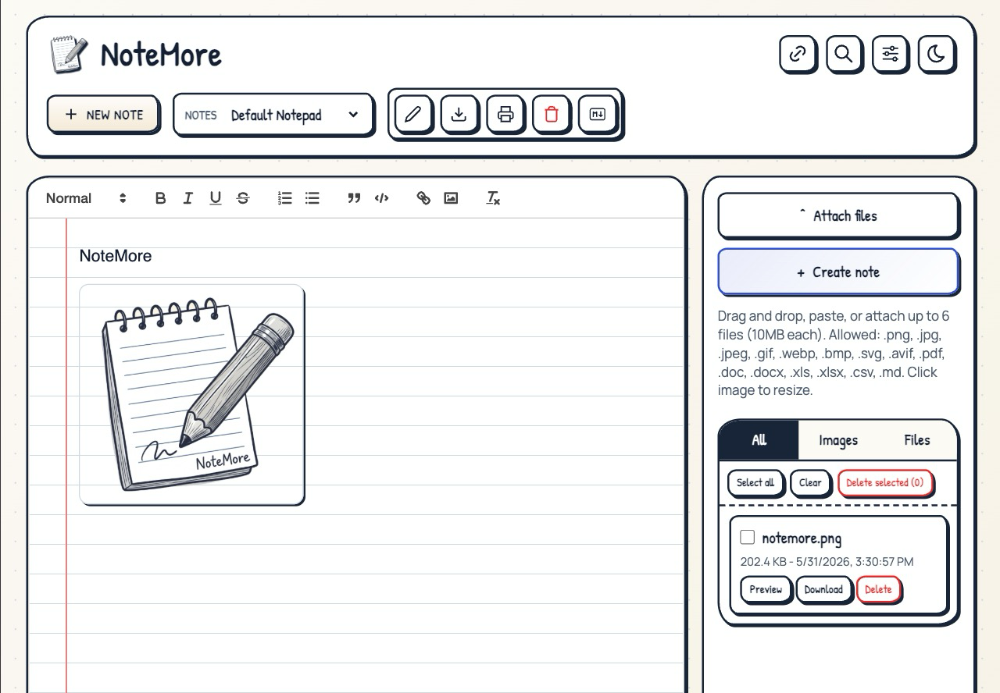

# NoteMore

A simple, modern notepad application with auto-save, optional PIN protection, and dark mode support.



<p align="center">
  <a href="https://github.com/luandnh/NoteMore/actions/workflows/docker-publish.yml" target="_blank"></a>
  
  
  
</p>

## Table of Contents

- [Product Update (May 2026)](#product-update-may-2026)
- [Features](#features)
- [Quick Start](#quick-start)
  - [Prerequisites](#prerequisites)
  - [Option 1: Docker](#option-1-docker)
  - [Option 2: Docker Compose](#option-2-docker-compose)
  - [Option 3: Run Locally](#option-3-run-locally)
- [Docker Permissions](#docker-permissions)
- [Configuration](#configuration)
- [Security](#security)
- [Technical Details](#technical-details)
- [Usage](#usage)
- [Links](#links)
- [Acknowledgements](#acknowledgements)
- [Contributing](#contributing)
- [Enhancement Ideas](#enhancement-ideas)

## Product Update (May 2026)

- UI refreshed to a clean sketch style with improved readability.
- Main workspace simplified to 2 columns (editor + actions/files panel).
- Quill toolbar layout and contrast fixes for both light and dark themes.
- Runtime branding switched to PNG logo (`notemore.png`) for favicon and in-app logo.
- Upload manager panel and modal/input controls visually aligned with the new style.

## Features

- Clean sketch UI (light/dark) with responsive layout
- WYSIWYG editor (Quill) with markdown storage compatibility
- Auto-save with save feedback and periodic persistence
- Multiple notepads with rename/delete/download/print actions
- Direct note links via URL and browser history navigation
- Fuzzy search across note names and content
- Upload manager (files + images) with preview/download/delete
- Drag-and-drop + clipboard paste uploads into editor
- Optional PIN protection (4-10 digits) with lockout safeguards
- PWA support with manifest + service worker cache updates
- Docker and Docker Compose deployment support

## Quick Start

### Prerequisites

- Docker (recommended)
- Node.js >=20.0.0 (for local development)

### Option 1: Docker

```bash
# Build locally and run
docker build -t notemore:latest .

docker run -p 3000:3000 \
  -v ./data:/app/data \
  notemore:latest
```

1. Go to http://localhost:3000
2. Start typing - Your notes auto-save
3. Verify your first note is saved

> **⚠️ Note**: If the container crashes with permission errors, see [Docker Permissions](#docker-permissions) below.

### Option 2: Docker Compose

Create a `docker-compose.yml` file:

```yaml
services:
  notemore:
    image: notemore:latest
    build: .
    container_name: notemore
    restart: unless-stopped
    ports:
      - ${NOTEMORE_PORT:-3000}:3000
    volumes:
      - ${NOTEMORE_DATA_PATH:-./data}:/app/data
    environment:
      # The title shown in the web interface
      SITE_TITLE: ${NOTEMORE_SITE_TITLE:-NoteMore}
      # Optional PIN protection (leave empty to disable)
      PIN_CODE: ${PIN_CODE:-}
      # The base URL for the application
      BASE_URL: ${NOTEMORE_BASE_URL:-http://localhost:3000} # Use ALLOWED_ORIGINS below to restrict cors to specific origins
      # (OPTIONAL)
      # Usage: Comma-separated list of urls: http://localhost:port,http://internalip:port,https://base.proxy.tld,https://authprovider.domain.tld
      # ALLOWED_ORIGINS: ${NOTEMORE_ALLOWED_ORIGINS:-http://localhost:3000} # Comment out to allow all origins (*)
      # LOCKOUT_TIME: ${NOTEMORE_LOCK_TIME:-15} # Customize pin lockout time (if empty, defaults to 15 in minutes)
      # MAX_ATTEMPTS: ${NOTEMORE_MAX_ATTEMPTS:-5} # Customize pin max attempts (if empty, defaults to 5)
      # COOKIE_MAX_AGE: ${NOTEMORE_COOKIE_MAX_AGE:-24} # Customize maximum age of cookies primarily used for pin verification (default 24) in hours
      # PAGE_HISTORY_COOKIE_AGE: ${NOTEMORE_PAGE_HISTORY_COOKIE_AGE:-365} # Customize age of cookie to show the last notepad opened (default 365 | max 400) in days - shows default notepad on load if expired
      # MAX_UPLOAD_SIZE_MB: ${NOTEMORE_MAX_UPLOAD_SIZE_MB:-10} # Max size per uploaded file in MB
      # MAX_UPLOAD_FILES: ${NOTEMORE_MAX_UPLOAD_FILES:-6} # Max number of files per upload request

      # MARKDOWN CODE SYNTAX HIGHLIGHTING (only use below if you want to restrict to specific languages):
      # By default, NoteMore includes support for all ~180 languages supported by highlight.js.
      # view entire list and usage in /docs/MARKDOWN_SYNTAX_HIGHLIGHTING_USAGE.md
      # HIGHLIGHT_LANGUAGES=c,csharp,css,dockerfile,go,html,java,javascript,json,kotlin,markdown,perl,php,python,ruby,sql,swift,typescript,xml,yaml
```

Then run:

```bash
docker compose up -d
```

1. Go to http://localhost:3000
2. Start typing - Your notes auto-save
3. Confirm notes are saved correctly

> **⚠️ Note**: If the container crashes with permission errors, see [Docker Permissions](#docker-permissions) below.

### Option 3: Run Locally

1. Install dependencies:

```bash
npm install
```

2. Set environment variables in `.env` or `cp .env.example .env`:

```bash
PORT=3000                  # Port to run the server on
PIN_CODE=1234          # Optional PIN protection
SITE_TITLE=NoteMore        # Custom site title
BASE_URL=http://localhost:3000  # Base URL for the application
```

3. Start the server:

```bash
npm start
```

#### Windows Users

If you're using Windows PowerShell with Docker, use this format for paths:

```powershell
docker run -p 3000:3000 -v "${PWD}\data:/app/data" notemore:latest
```

## Docker Permissions

### ⚠️ Important: Docker Permission Issues (New Installations & Upgrades)

NoteMore runs as a non-root user (UID 1000) inside the Docker container for improved security. This can cause permission issues in two scenarios:

1. **Upgrading from a previous version**: Existing data directory may have incorrect permissions, causing notepads to appear blank
2. **Fresh installation**: Docker may create the data directory with host user permissions that do not match UID 1000, causing container restart loops with `EACCES: permission denied` errors

#### Symptoms

- **Fresh installations**: Container crashes on startup with `Error: EACCES: permission denied, open '/app/data/notepads.json'`
- **Upgrades**: Previously saved notepads appear blank or empty

#### Solution

##### Option 1: Fix Existing Installation

Set the ownership of your data directory to match the container's non-root user (UID 1000):

**Linux/macOS:**

```bash
# Stop the container first
docker stop notemore

# Fix permissions (replace /path/to/your/data with your actual path)
sudo chown -R 1000:1000 /path/to/your/data
```

**Example for common setups:**

```bash
# If using the default ./data directory
sudo chown -R 1000:1000 ./data

# If using a custom path like /opt/docker/notemore
sudo chown -R 1000:1000 /opt/docker/notemore

# For Unraid users
sudo chown -R 1000:1000 /mnt/user/appdata/notemore
```

**Windows (Docker Desktop):**

```powershell
# Windows users typically don't need to change permissions
# Docker Desktop handles volume permissions automatically
```

##### Option 2: Preventive Setup (Fresh Installations)

For new installations, create the data directory with correct permissions **before** starting the container:

**Linux/macOS:**

```bash
# Create data directory
mkdir -p ./data

# Set correct ownership
sudo chown -R 1000:1000 ./data

# Now start the container
docker compose up -d
```

**Windows (Docker Desktop):**

```powershell
# No special setup needed - Docker Desktop handles permissions automatically
docker compose up -d
```

#### Verifying the Fix

After updating permissions, verify everything is working:

1. **Start/Restart the container:**

   ```bash
   docker restart notemore
   # or if starting fresh
   docker compose up -d
   ```

2. **Check container logs** (should start without errors):

   ```bash
   docker logs notemore
   ```

3. **Verify file ownership inside container:**

   ```bash
   docker exec notemore ls -la /app/data
   ```

   You should see files owned by `node` or UID `1000`

4. **Test the application** by accessing http://localhost:3000 and creating a test notepad

#### Why This Change?

Running containers as non-root users is a security best practice that:

- Limits potential damage from container escapes
- Reduces attack surface
- Aligns with security compliance standards

## Core Capabilities (Detailed)

- 📝 Auto-saving notes
- 🌓 Dark/Light mode support
- 🔒 Optional PIN protection
- 📱 Mobile-friendly interface / PWA Support
- 🗂️ Multiple notepads
- 📄 Enhanced Markdown Formatting with GitHub-style alerts and extended tables
- 🔗 Direct notepad linking with shareable URLs
- 🧭 Browser navigation support (back/forward buttons)
- ⬇️ Download notes as text or markdown files
- 🖨️ Print functionality with auto-expanded collapsible sections
- 🔍 Fuzzy Search by name or contents
- 🔄 Real-time saving
- 💽 Add .txt files into data folder to import (requires page refresh)
- ⚡ Zero dependencies on client-side
- 🛡️ Built-in security features
- 🎨 Clean, modern interface
- 📦 Docker support with easy configuration
- 🌐 Optional CORS support
- ⚙️ Customizable settings
- 🔄 Automatic cache updates and version management

## Configuration

### Environment Variables

| Variable                | Description                                                  | Default               | Required |
| ----------------------- | ------------------------------------------------------------ | --------------------- | -------- |
| PORT                    | Server port                                                  | 3000                  | No       |
| BASE_URL                | Base URL for the application                                 | http://localhost:PORT | Yes      |
| PIN_CODE                | PIN protection (4-10 digits)                                 | None                  | No       |
| SITE_TITLE              | Site title displayed in header                               | NoteMore              | No       |
| NODE_ENV                | Node environment mode (development or production)            | production            | No       |
| ALLOWED_ORIGINS         | Allowed CORS origins (`*` for all or comma-separated list)   | \*                    | No       |
| LOCKOUT_TIME            | Lockout time after max PIN attempts (in minutes)             | 15                    | No       |
| MAX_ATTEMPTS            | Maximum PIN entry attempts before lockout                    | 5                     | No       |
| COOKIE_MAX_AGE          | Maximum age of authentication cookies (in hours)             | 24                    | No       |
| PAGE_HISTORY_COOKIE_AGE | Age of cookie storing last opened notepad (in days, max 400) | 365                   | No       |
| TRUST_PROXY             | Enable proxy trust for X-Forwarded-For headers               | false                 | No       |
| TRUSTED_PROXY_IPS       | Comma-separated list of trusted proxy IPs                    | None                  | No       |
| HIGHLIGHT_LANGUAGES     | Comma-separated list of code syntax languages to restrict to | all if not supplied   | No       |
| MAX_UPLOAD_SIZE_MB      | Maximum upload size per file in MB                           | 10                    | No       |
| MAX_UPLOAD_FILES        | Maximum files accepted per upload request                    | 6                     | No       |

### Proxy Trust Configuration

When deploying NoteMore behind a reverse proxy (nginx, Apache, Cloudflare, etc.), you may need to configure proxy trust to correctly identify client IP addresses for rate-limiting and authentication.

#### ⚠️ Security Warning

**By default, `TRUST_PROXY` is `false`** (most secure). Only enable proxy trust if you're deploying behind a trusted reverse proxy. Incorrect configuration can allow attackers to bypass rate-limiting and authentication by spoofing the `X-Forwarded-For` header.

#### When to Enable Proxy Trust

Enable `TRUST_PROXY=true` only if:

1. You're deploying behind a reverse proxy (nginx, Cloudflare, etc.)
2. The proxy adds `X-Forwarded-For` headers
3. You can explicitly list all trusted proxy IPs in `TRUSTED_PROXY_IPS`

#### Configuration Examples

**Example 1: Behind nginx on the same host**

```bash
TRUST_PROXY=true
TRUSTED_PROXY_IPS=127.0.0.1
```

**Example 2: Docker with nginx reverse proxy**

```bash
TRUST_PROXY=true
TRUSTED_PROXY_IPS=172.17.0.1  # Docker default gateway IP
```

**Example 3: Multiple proxies (load balancer + nginx)**

```bash
TRUST_PROXY=true
TRUSTED_PROXY_IPS=10.0.0.1,10.0.0.2  # IPs of both proxies
```

**Example 4: Cloudflare (using Cloudflare IPs)**

```bash
TRUST_PROXY=true
# List all Cloudflare IP ranges that connect to your origin
# See: https://www.cloudflare.com/ips/
TRUSTED_PROXY_IPS=173.245.48.0,103.21.244.0,103.22.200.0,...
```

#### Finding Your Proxy IP

To find your proxy's IP address:

**Docker:**

```bash
docker network inspect bridge | grep Gateway
```

**Check incoming connections:**

```bash
# While NoteMore is running, check who's connecting
netstat -tn | grep :3000
```

#### How It Works

- When `TRUST_PROXY=false` (default): Always uses the direct socket IP address, ignoring `X-Forwarded-For` headers
- When `TRUST_PROXY=true` with `TRUSTED_PROXY_IPS`: Validates the immediate connecting IP against the trusted list before trusting `X-Forwarded-For`
- When `TRUST_PROXY=true` without `TRUSTED_PROXY_IPS`: Trusts `X-Forwarded-For` from any source (⚠️ not recommended for production)

## Security

### Features

- Variable-length PIN support (4-10 digits)
- Constant-time PIN comparison
- Brute force protection:
  - 5 attempts maximum
  - 15-minute lockout after failed attempts
  - IP-based tracking with spoofing protection
  - Validated client IP extraction (ignores untrusted X-Forwarded-For by default)
- Secure cookie handling
- No client-side PIN storage
- Rate limiting
- Collaborative editing
- CORS support for origin restrictions (optional)
- Configurable proxy trust with IP validation

## User Settings

Access settings via the gear icon (⚙️) in the header or use keyboard shortcut:

- **Windows/Linux**: `Ctrl+Alt+,`
- **macOS**: `Cmd+Ctrl+,`

### Available Settings

| Setting                        | Description                                              | Default  | Options                   |
| ------------------------------ | -------------------------------------------------------- | -------- | ------------------------- |
| **Auto-save Status Interval**  | Time interval for auto-save notifications (0 = disabled) | 1000ms   | Any number (milliseconds) |
| **Remote Connection Messages** | Show notifications when users connect/disconnect         | Enabled  | Enabled/Disabled          |
| **Disable Print Expansion**    | Prevent auto-expanding collapsed sections when printing  | Disabled | Enabled/Disabled          |
| **Default Markdown Preview**   | Default view when loading NoteMore (Client-based)        | Editor   | Editor, Split, Full       |

### Notepad Management

- **Unique Names**: Notepad names are automatically made unique by the server. If you try to create or rename a notepad with an existing name, the server will append a suffix (e.g., "Note-1", "Note-2")
- **Name Validation**: The server handles all name validation and uniqueness checks. The frontend will display a notification if your requested name was modified
- **Auto-save**: Changes are automatically saved every 300ms after you stop typing, with periodic saves every 2 seconds
- **Persistence**: All settings are stored in your browser's local storage and persist across sessions

## Architecture Summary

### Stack

- **Backend**: Node.js (>=20.0.0) with Express
- **Frontend**: Vanilla JavaScript (ES6+) with enhanced markdown support
- **Container**: Docker with multi-stage builds
- **Security**: Express security middleware
- **Storage**: File-based with auto-save
- **Theme**: Dynamic dark/light mode with system preference support
- **PWA**: Service Worker with automatic cache updates and version management
- **Markdown**: Enhanced with alert blocks, extended tables, and collapsible content
- **Real-time**: WebSocket-based collaboration and live updates
- **Navigation**: SPA-style routing with shareable URLs and browser history support
- **Print**: Advanced print preview with auto-expanding collapsible content and theme preservation

### Dependencies

- express: Web framework
- cors: Cross-origin resource sharing
- dotenv: Environment configuration
- cookie-parser: Cookie handling
- express-rate-limit: Rate limiting
- marked: Markdown formatting
- marked-alert: GitHub-style alert blocks for markdown
- marked-extended-tables: Enhanced table support for markdown
- marked-highlight: Syntax highlighting for code blocks in markdown
- @highlightjs/cdn-assets: Highlight.js assets for code syntax highlighting
- fuse.js: Fuzzy searching
- ws: WebSocket support for real-time collaboration
- multer: Multipart upload handling for file/image attachments

The `data` directory contains:

- `notepads.json`: List of all notepads
- Individual `.txt` files for each notepad's content
- `uploads/`: Local attachment storage for uploaded image/files
- Drop in .txt files to import notes (requires page refresh)

⚠️ Important: Never delete the `data` directory when updating! This is where all your notes are stored.

## Usage

### Basic Operations

- **Start typing**: Notes auto-save as you type (every 300ms after stopping, with periodic saves every 2 seconds)
- **Theme toggle**: Switch between light/dark mode with the toggle button
- **Force save**: `Ctrl+S` (or `Cmd+S` on Mac)
- **Search**: `Ctrl+K` (or `Cmd+K`) to open fuzzy search across all notepads
- **Copy link**: Click the link button (🔗) to copy the current notepad's shareable URL
- **Settings**: Click the gear icon (⚙️) or use `Ctrl+Alt+,` (or `Cmd+Ctrl+,`)
- **Attach files**: Click **Attach files** in the right panel to upload files/images and insert markdown links
- **Paste image/files**: Paste directly into the editor to auto-upload and insert links

### Notepad Management

- **Create**: Click the + button or `Ctrl+Alt+N` (or `Cmd+Ctrl+N`)
- **Rename**: Click rename button or `Ctrl+Alt+R` (or `Cmd+Ctrl+R`)
- **Delete**: Click delete button or `Ctrl+Alt+X` (or `Cmd+Ctrl+X`)
- **Navigate**: Use dropdown, arrow keys (`Ctrl+Alt+↑/↓`), or browser back/forward buttons
- **Download**: Click download button or `Ctrl+Alt+A` (or `Cmd+Ctrl+A`) for .txt/.md export
- **Print**: `Ctrl+P` (or `Cmd+P`) with enhanced formatting and auto-expanded collapsible sections

### URL Parameters

- **Direct notepad linking**: `?id=notepadname` - Opens a specific notepad by name (case-insensitive)
- **Browser navigation**: Use back/forward buttons to navigate between notepads
- **Shareable URLs**: Copy links to share specific notepads with others

## Technical Details

- Backend: Node.js with Express
- Frontend: Vanilla JavaScript
- Storage: File-based storage in `data` directory
- Styling: Modern CSS with CSS variables for theming
- Security: Constant-time PIN comparison, brute force protection

## Links

- Repository: use this workspace's Git remote
- Docker: build locally with `docker build -t notemore:latest .`

## Acknowledgements

- This project is based on ideas and direction from [DumbPad by DumbWareio](https://github.com/DumbWareio/DumbPad).

## Contributing

1. Fork the repository
2. Create your feature branch (`git checkout -b feature/amazing-feature`)
3. Commit your changes using conventional commits
4. Push to the branch (`git push origin feature/amazing-feature`)
5. Open a Pull Request

See Development Guide for local setup and guidelines.

## Enhancement Ideas

Potential improvements that can be added next:

- Rich text collaboration presence: better cursor labels, user colors, and reconnect UX.
- Upload lifecycle upgrades: rename file, move between groups, and multi-file drag ordering.
- Note organization: tags, favorites, pin-to-top, and archived notes.
- Advanced editor tooling: slash command menu, templates/snippets, and keyboard shortcut cheat sheet.
- Better search UX: filters (title/content/date), recent searches, and highlighted context jump.
- Export enhancements: PDF export with theme-aware formatting and batch export.
- Version history: per-note timeline with restore points and diff view.
- Security additions: optional session timeout, PIN rotation reminder, and stricter CSP defaults.
- Accessibility improvements: higher-contrast preset, reduced-motion mode, and screen-reader landmarks audit.
- Multi-device sync option: optional pluggable backend sync providers.

Got an idea? Open an issue or submit a PR.
